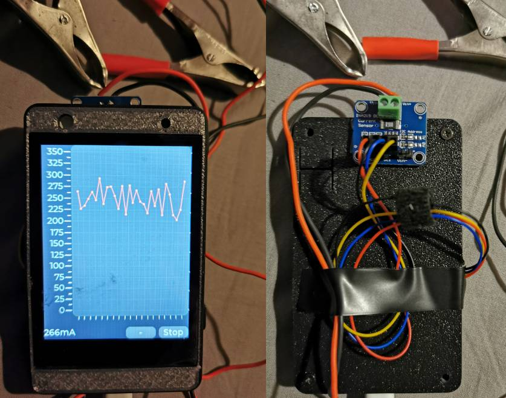
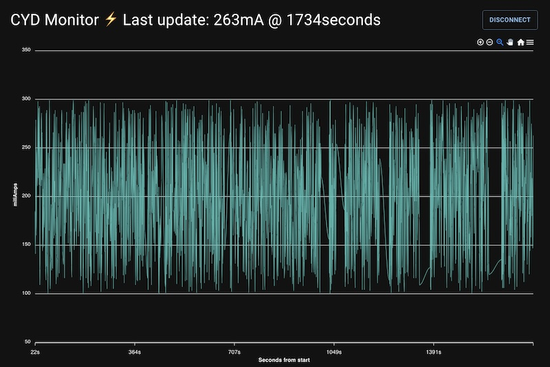

# cyd-current-meter

- [BLE Web Client](https://sonictruth.github.io/cyd-current-meter/)
- [ESP32 2432S032C](https://github.com/witnessmenow/ESP32-Cheap-Yellow-Display) (aka Cheap Yellow Display)
- [INA219](https://www.ti.com/lit/ds/symlink/ina219.pdf) Current meter module
- [3D printed case](https://www.thingiverse.com/thing:6290847)
- [LVGL UI](https://lvgl.io/)

 

 